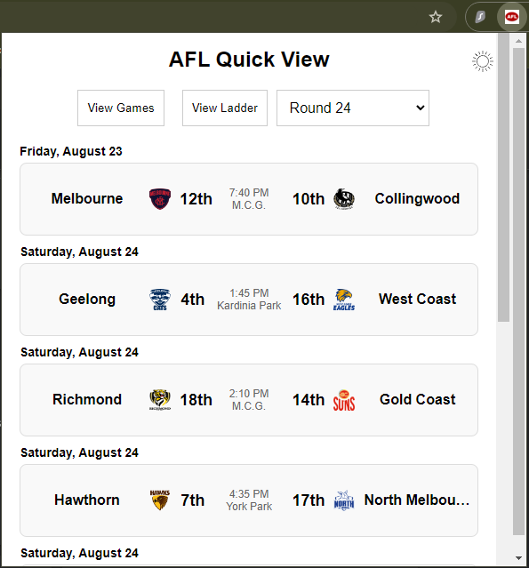
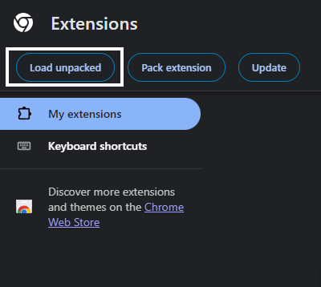
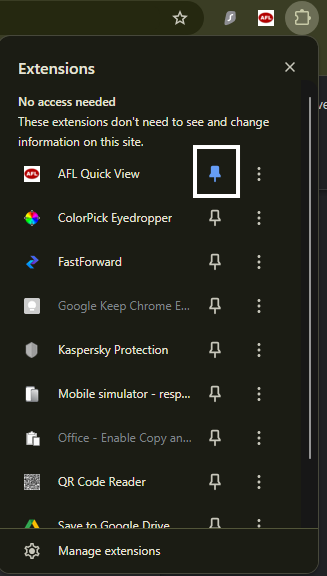
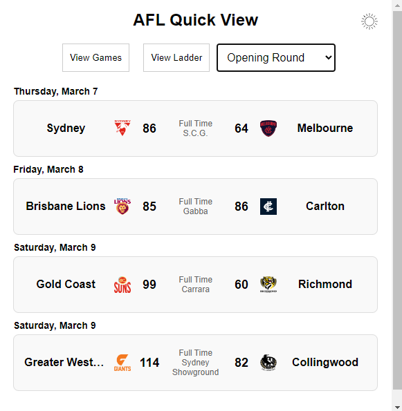
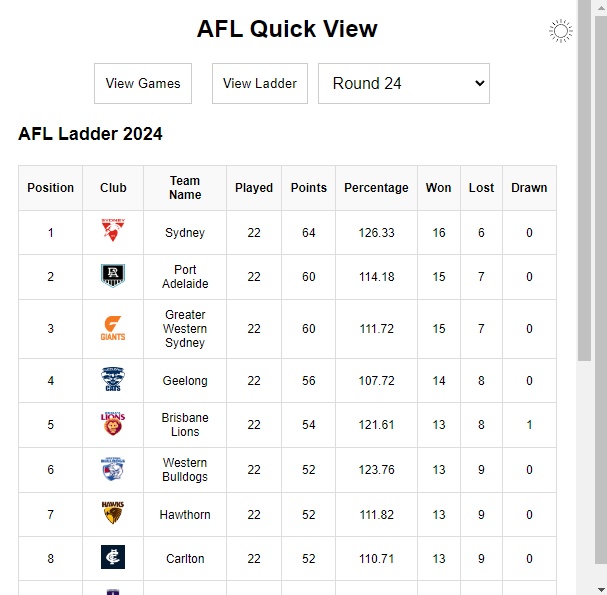

# AFL Quick View Chrome Extension

AFL Quick View is a Chrome extension that allows you to quickly view the current AFL games and the league ladder, all within a single, easy-to-use popup. This extension helps you stay updated with AFL scores, upcoming games, and the latest standings.



## Features

- **View Current Games**: Displays the current round of AFL games with team logos, match times, and scores (or ladder positions for future games).
- **Ladder View**: Quickly switch to view the current AFL ladder, complete with team logos, positions, and statistics.
- **Dark/Light Mode**: Toggle between dark and light themes based on your preference or system settings.


## Installation

### Prerequisites

- [Google Chrome](https://www.google.com/chrome/)
- Basic knowledge of Chrome extensions and unpacking them

### Steps to Load the Extension Unpacked

1. Clone or download this repository to your local machine.

```bash
git clone https://github.com/yourusername/afl-quick-view.git
```

2. Open Google Chrome and navigate to `chrome://extensions/`.

3. Enable **Developer mode** by toggling the switch in the top-right corner.

4. Click on **Load unpacked** and select the directory where you cloned this repository.



5. The AFL Quick View extension should now be installed and visible in your Chrome extensions list.

6. Pin the extension to your Chrome toolbar for easy access.



## Usage

- **View Games**: Click on the extension icon to open the popup. By default, the extension displays the current round of games. Use the dropdown to select different rounds.
  
- **View Ladder**: Switch between viewing games and the ladder by clicking the "View Ladder" button.




- **Theme Toggle**: Toggle between dark and light themes using the sun/moon icon at the top-right corner of the popup.

## Development

### Caching

The extension caches game and ladder data for one hour to reduce the number of API requests and provide quicker access to data. If you want to clear the cache, you can do so by reloading the extension via the `chrome://extensions/` page.

### API Usage

This extension utilizes the [Squiggle API](https://api.squiggle.com.au/) to fetch AFL game data and standings.

### Contributions

Contributions are welcome! Please fork this repository and submit a pull request with your changes.


## License

This project is licensed under the MIT License - see the [LICENSE](LICENSE) file for details.
